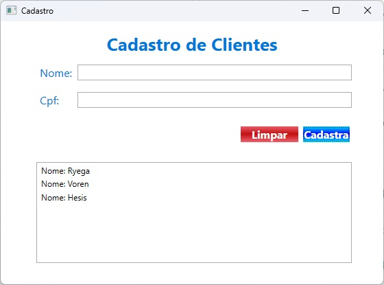
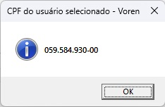
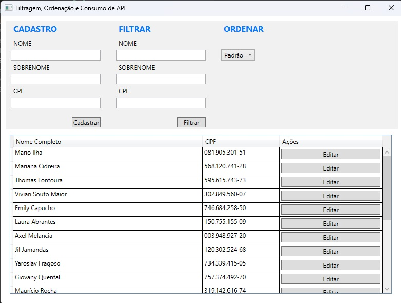
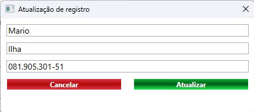

# 🖥️ Projetos desktop Desenvolvidos com WPF e WinUI

## Projeto para cadastro e listagem de Clientes
Projeto simples para cadastro e listagem de clientes. Modelo utilizado: Id, Name, Cpf e DataRegister.
Para realização de cadastro são aplicadas algumas validações como:

- Campos de preenchimento obrigatório;
- Campo nome deve ter pelo menos 3 caracteres;
- CPF deve ser válido;

[Clique aqui para acessar o diretório do projeto](./RegisterWPF/)

## Projeto 2 com WPF

Trata de um projeto para cadastro, listagem e atualização de pessoas. O modelo é composto por Id, Name, Surname, Fullname, CPF e registeredAt, porém apenas as informações FullName e CPF são exibidas, além de um botão que permite a edição destes dados (ao clicá-lo abre uma janela com os dados editáveis).

[Clique aqui para acessar o diretório do projeto](./FilteringSortingApi/)

## Projeto 2 refatorado para WinUI 3

🔗 [Clique aqui para acessar o diretório do projeto](./FilteringSortingApiWinUi/)